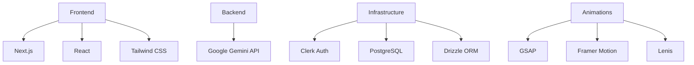

# 🪄 AI Content Generator


<div align="center">
  
  <p><em>Transform your ideas into polished content with the power of AI</em></p>
</div>

## 🌟 Overview

**AI Content Generator** harnesses cutting-edge AI technology to help creators produce high-quality content in seconds. Perfect for writers, marketers, and content creators looking to enhance their productivity while maintaining creative control.

<div align="center">
  <table>
    <tr>
      <td align="center"><b>🚀 Instant</b><br>Generate content within seconds</td>
      <td align="center"><b>✨ Creative</b><br>Diverse styles and tones</td>
      <td align="center"><b>🔍 Smart</b><br>Context-aware suggestions</td>
    </tr>
  </table>
</div>

## 💻 Technology Stack



## ✨ Key Features

- **AI-Powered Content Creation** - Generate blog posts, marketing copy, social media content and more
- **Customization Options** - Adjust tone, style, and length to match your brand
- **User Authentication** - Secure access with Clerk authentication
- **Content History** - Save and revisit your generated content
- **Responsive Design** - Perfect experience on any device
- **Stunning Animations** - Beautiful UI transitions powered by GSAP and Framer Motion

## 📱 App Preview

<div align="center">
  <table>
    <tr>
      <td align="center">
        <br />
        <em>Dashboard</em>
      </td>
      <td align="center">
        <br />
        <em>Content Generator</em>
      </td>
      <td align="center">
        <br />
        <em>Content History</em>
      </td>
    </tr>
  </table>
</div>

## 🚀 Getting Started

```bash
# Clone the repository
git clone https://github.com/yourname/ai-content-generator.git

# Navigate to the project directory
cd ai-content-generator

# Install dependencies
npm install

# Set up environment variables
cp .env.example .env.local

# Start the development server
npm run dev
```

### Prerequisites

- Node.js 18+ 
- Google Gemini API key
- Clerk account for authentication
- PostgreSQL database

## 📊 Project Architecture

```
ai-content-generator/
├── app/
│   ├── api/
│   ├── auth/
│   ├── dashboard/
│   ├── generate/
│   └── history/
├── components/
│   ├── ui/
│   ├── auth/
│   ├── content/
│   └── shared/
├── lib/
│   ├── db/
│   ├── ai/
│   └── utils/
├── styles/
├── public/
└── ...configuration files
```

## 🔒 Environment Variables

```
# API Keys
GEMINI_API_KEY=your_gemini_api_key

# Authentication
CLERK_PUBLISHABLE_KEY=your_clerk_publishable_key
CLERK_SECRET_KEY=your_clerk_secret_key

# Database
DATABASE_URL=your_postgresql_connection_string
```

## 🤝 Contributing

Contributions are welcome! Please feel free to submit a Pull Request.

1. Fork the repository
2. Create your feature branch (`git checkout -b feature/amazing-feature`)
3. Commit your changes (`git commit -m 'Add some amazing feature'`)
4. Push to the branch (`git push origin feature/amazing-feature`)
5. Open a Pull Request

## 📜 License

This project is licensed under the MIT License - see the LICENSE file for details.

## 🙏 Acknowledgments

- Google Gemini for the powerful AI capabilities
- The Next.js team for the amazing framework
- Tailwind CSS for the utility-first CSS framework
- All open-source contributors who make this possible

---

<div align="center">
  <p>
    <a href="https://twitter.com/yourhandle">Twitter</a> •
    <a href="https://www.linkedin.com/in/yourprofile/">LinkedIn</a> •
    <a href="https://www.buymeacoffee.com/yourusername">Buy Me a Coffee</a>
  </p>
  <p>Made with ❤️ by Your Name</p>
</div>
